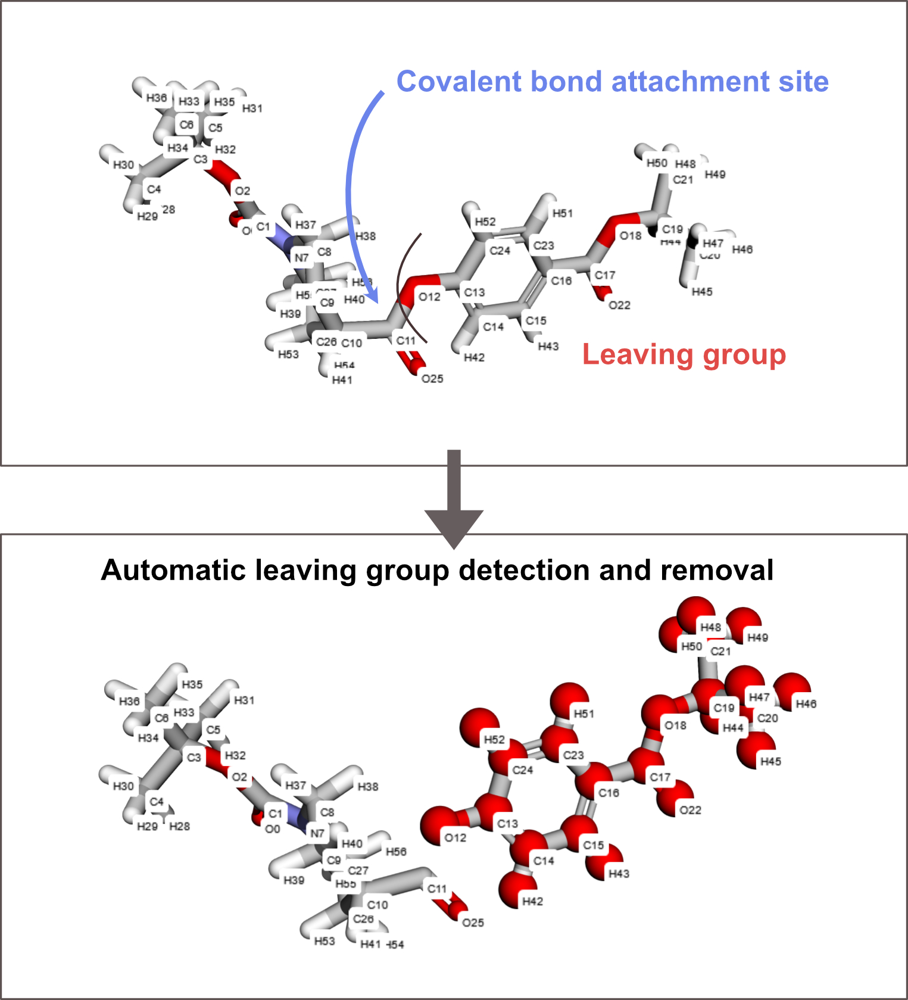

# AlphaFold3-GUI

Welcome to the AlphaFold3-GUI repository! This project provides a user-friendly graphical user interface (GUI) for the generation of AlphaFold 3 input files, enabling researchers to easily set up, run, and analyze protein structure predictions without the need for extensive .json and .mmCIF editing.
---
## Installation

### Prerequisites
- Python 3.8+
- Required Python packages (see `requirements.txt`)
- AlphaFold 3 installed and configured on your system

### Steps
1. Clone this repository:
   ```bash
   git clone https://github.com/sieber-lab/AlphaFold3-GUI.git
   cd AlphaFold3-GUI
   ```
2. Install the dependencies:
   ```bash
   pip install -r requirements.txt
   ```
3. Run the application:
   ```bash
   streamlit run streamlit_app.py
   ```

## Usage

### Step 1: Launch the GUI
After running `streamlit run streamlit_app.py`, the AlphaFold3-GUI window will open. From here, you can generate your .json file.
Alternatively, you can use the publicly accessible webserver: https://alphafold3-gui.streamlit.app/ 

### Step 2: Configure Input File
1. Adjust prediction parameters such as proteins, and nucleic acids, ions, and ligands, similar to the AlphaFold3 Webserver.
2. Unlike the AlphaFold3 Webserver, this interface supports covalent bond generation to any type of ligand, simply by SMILES input.
3. Additionally, the interface supports editing of covalent ligands by:

5. Selecting a leaving group via the 3D molecule visualization.
6. Selecting the target atom using the 3D visualization.
7. Use the built-in **JSON Generator** to create a JSON file that meets AlphaFold 3's input requirements.

### Step 4: Run Prediction
1. Once the setup is complete, simply download the .json file, and use it as input for your AlphaFold3 prediction

## License

This project is licensed under the Apache License. See the `LICENSE` file for details.

## Acknowledgments

Special thanks to the contributors and the AlphaFold team for their incredible work in advancing protein structure prediction.

